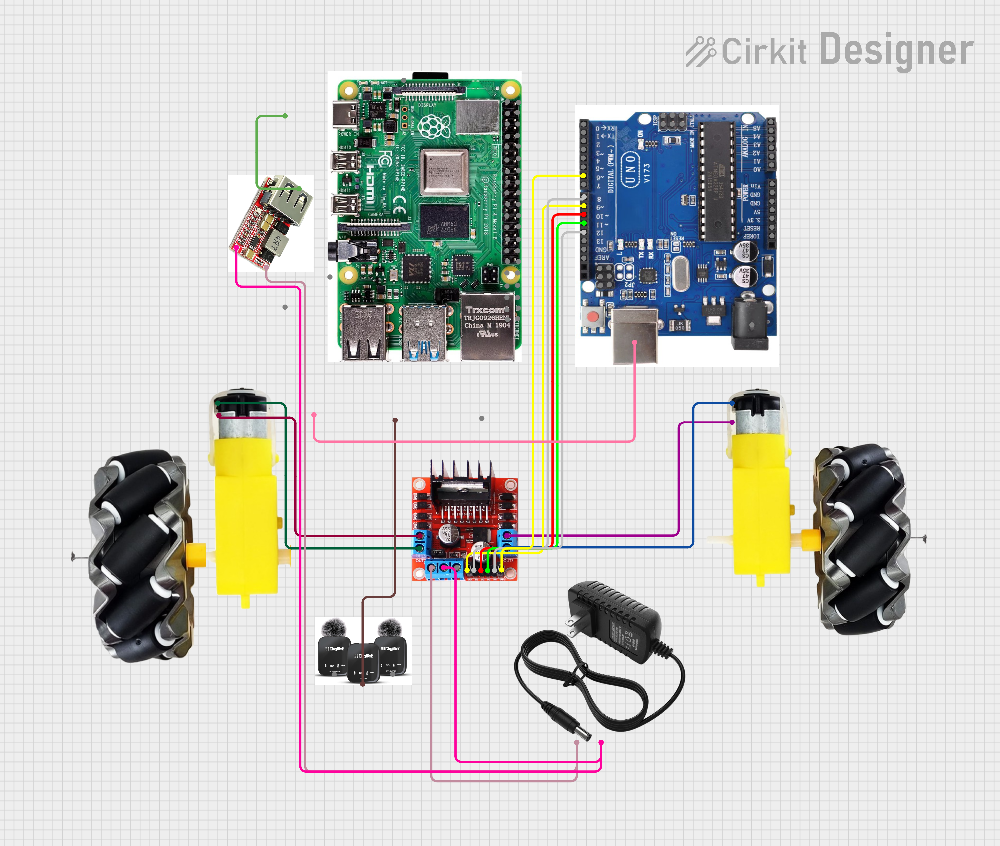

# Voice-LLM Robot 

### **Stop talking to walls. Talk to your hardware.**
Most "voice-controlled" robots are just glorified remote controls with a limited vocabulary. This one has a local **LLaMA 3.2** brain running on a Raspberry Pi, meaning it actually understands what you want, even if you don't say it perfectly. It's the difference between a scripted NPC and a physical agent that thinks.

---

##  The Actual Experience
Forget memorizing "Move Forward 5 Seconds." Just tell it what to do like a normal person.
> *"Yo, cruise forward for a bit, then pull a sharp left and wait there."*


### **Why this isn't just another tutorial project:**
* **Privacy by Default:** Everything runs on-device via **Ollama**. No data leaves your room, and no big-tech company is listening.
* **Conversational Logic:** It handles intent. If you're vague, the LLM fills the gaps. If you're specific, it executes perfectly.
* **Hybrid Engine:** We use heuristics for the simple stuff (instant response) and the LLM for complex maneuvers.
* **Hardware Combo:** Uses the **Raspberry Pi** for high-level reasoning and the **Arduino Mega** for rock-solid motor execution.

---

##  The Hardware Stack

 

| Component | The Job |
| :--- | :--- |
| **Raspberry Pi 4B** | The Pre-frontal Cortex. Handles mic input and the LLaMA 3.2 brain. |
| **Arduino Mega** | The muscles. Handles real-time PWM and motor pulses via Serial. |
| **L298N Driver** | The nervous system. Keeps the motors from frying your boards. |
| **12V LiPo** | The heart. Providing the juice to actually move. |
| **Microphone** | The ears. Captures your voice commands. |

**Microphone used:** [Digitek Wireless Microphone (DWM 101)](https://amzn.in/d/0imarqwx)

---

##  Getting Started

### **The 1-Click Version**
I hate manual setup as much as you do. Use the script:
```bash
chmod +x run.sh
./run.sh
```
*Basically, it does everything for you. All you need to do next is speak.*

### **The "I want to do it myself" Way**
```bash
# Set up the environment
python -m venv .venv
source .venv/bin/activate 

# Get the dependencies and the brain
pip install -r requirements.txt
ollama pull llama3.2:1b

# Wake it up
python python/robot_brain.py
```

---

##  Future Upgrades:
This project is just the beginning. Here are five ways to evolve this robot into a professional-grade agent:

| Upgrade | The Vision |
| :--- | :--- |
| **Computer Vision** | Mount a camera for Multimodal AI. Say *"Find the red ball"* or *"Follow me."* |
| **SLAM & Mapping** | Use RP-Lidar for Global Navigation. Ask the robot to *"Go to the kitchen."* |
| **Obstacle Avoidance** | Add ultrasonic sensors for a "Reflex Layer" to prevent the robot from crashing. |
| **Semantic Memory** | Use a Vector Database (RAG) so it remembers landmarks like *"my charger."* |
| **Swarm Intelligence** | Use ROS2 or MQTT to control a fleet of robots with a single LLaMA brain. |