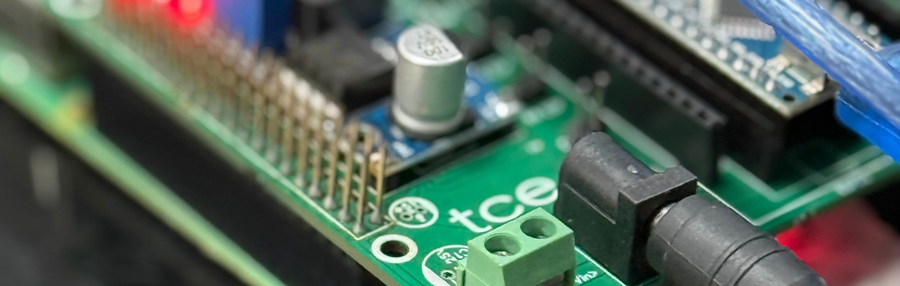
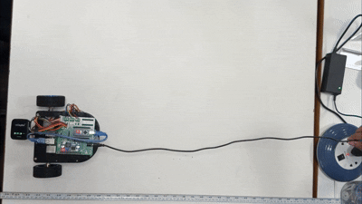

# Voice-LLM Robot 



### **Stop talking to walls. Talk to your hardware.**
Most "voice-controlled" robots are just glorified remote controls. This one has a real **AI Brain (LLaMA 3.2)**. It doesn't just listen; it *understands* what you want, even if you use slang or different measurements.

---

## The Experience
You don't need to memorize commands. Just speak naturally:
> *"Yo, go forward 50 cm, then turn left and go forward for 30cm then turn left and go forward for 1 second then turn 90 degree to the left.."*



---

## 🤔 How does it work?
1. **The Ears (Microphone)**: Captures your voice.
2. **The Brain (Raspberry Pi + AI)**: Uses **Ollama** (an AI engine) to understand your intent.
3. **The Muscles (Arduino Nano)**: Receives the "thought" and physically moves the wheels.

---

## 🏗️ What you need
| Part | Role |
| :--- | :--- |
| **Raspberry Pi** | The AI Brain (where the thinking happens). |
| **Arduino Nano** | The Muscle (where the moving happens). |
| **Microphone** | The Ears (to hear your commands). |
| **L298N Driver** | The Power Bridge (to move the motors). |

---

## 🚀 Easy Setup Guide

### **Step 1: Download the Project**
Open your terminal on the Raspberry Pi and paste this:
```bash
git clone https://github.com/yaseenzj/voice-llm-robot-control.git
cd voice-llm-robot-control
```

### **Step 2: Install the AI Engine (Ollama)**
This gives your robot its "intelligence." Run these two lines:
```bash
# Install Ollama
curl -fsSL https://ollama.com/install.sh | sh

# Download the LLaMA Brain
ollama pull llama3.2:1b
```

### **Step 3: Prepare the Muscles (Arduino)**
1. Connect your **Arduino Nano** to your computer.
2. Open the file `arduino/motor_control/motor_control.ino` in the Arduino software.
3. Click **Upload**.
4. Now, plug the Arduino into your Raspberry Pi using a USB cable.

> [!TIP]
> **Stable Connection**: The code is pre-configured to use the permanent port `/dev/robot_nano`. This means your robot will always find its "muscles" correctly, even if you swap USB ports!

### **Step 4: Wake it Up! ⚡**

#### **🚀 The Easy Way (Recommended)**
Run this script and follow the on-screen instructions to select your microphone:
```bash
bash run.sh
```

#### **🛠️ The Manual Way**
If you prefer running it manually (replace `[ID]` with your mic index):
```bash
python3 -m venv .venv
source .venv/bin/activate
python3 python/robot_encoded.py [ID]
```

---

## 🛠️ Key Features
* **Talk Naturally**: Use "cm", "meters", "seconds", or even slang.
* **Easy Mic Setup**: The robot will ask you which microphone you want to use.
* **Auto-Fix**: The script automatically fixes common audio errors so you don't have to.

---

## 🔮 Future Upgrades
* **Eyes**: Add a camera so it can "see" objects.
* **Safety**: Add sensors so it doesn't bump into walls.
* **Memory**: Make it remember where its charger is.